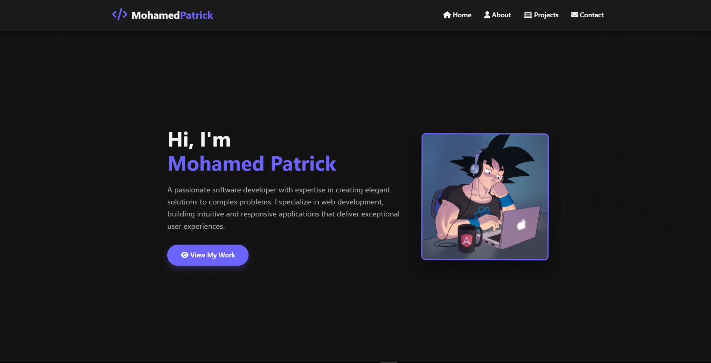

# Portfolio-Website

A personal portfolio website to showcase my projects, skills, and experience as a developer.

🚀 **Live Website:** [Open To Website](https://mhpat.vercel.app/)

## 🛠 Tech Stack

- **HTML**
- **CSS**
- **JavaScript**

## 📌 Features

- Responsive and modern UI
- Project showcase section
- About me and contact section
- Clean, accessible code

## 📷 Preview

 

## 📁 Getting Started

To run this project locally:

```bash
git clone https://github.com/paatrike/Portfolio-Website.git
cd Portfolio-Website
open index.html
